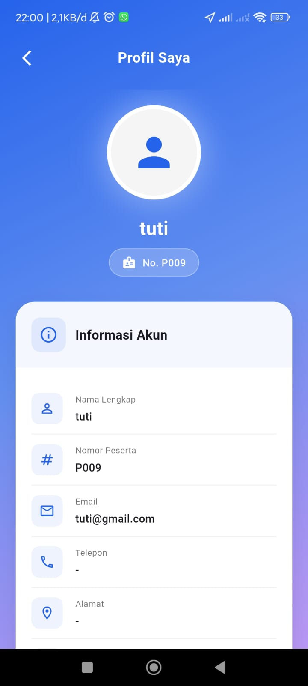
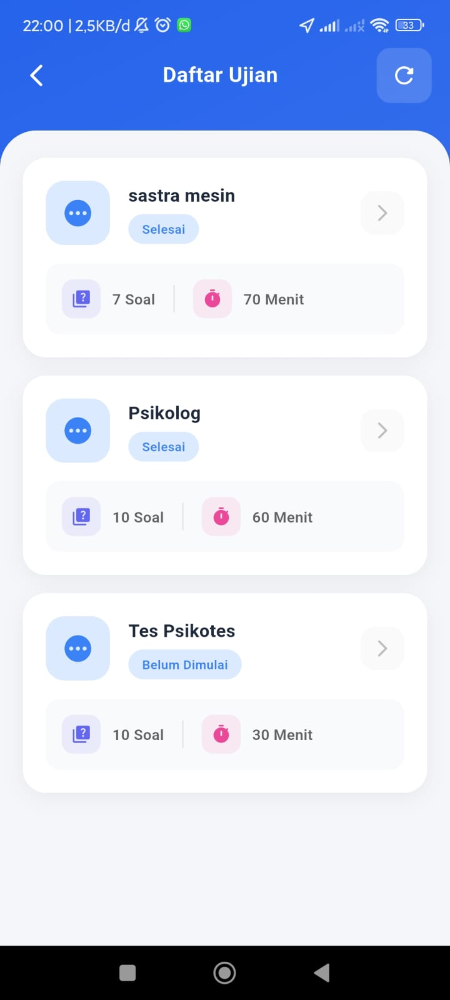
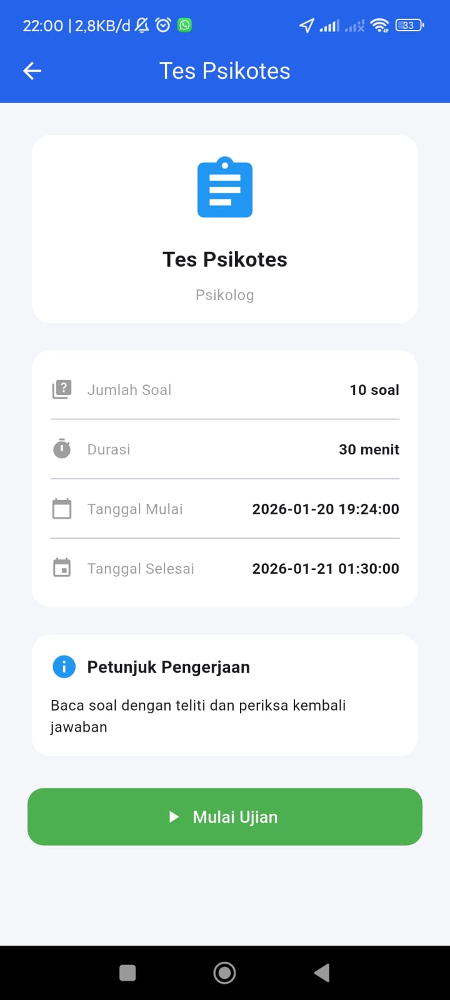
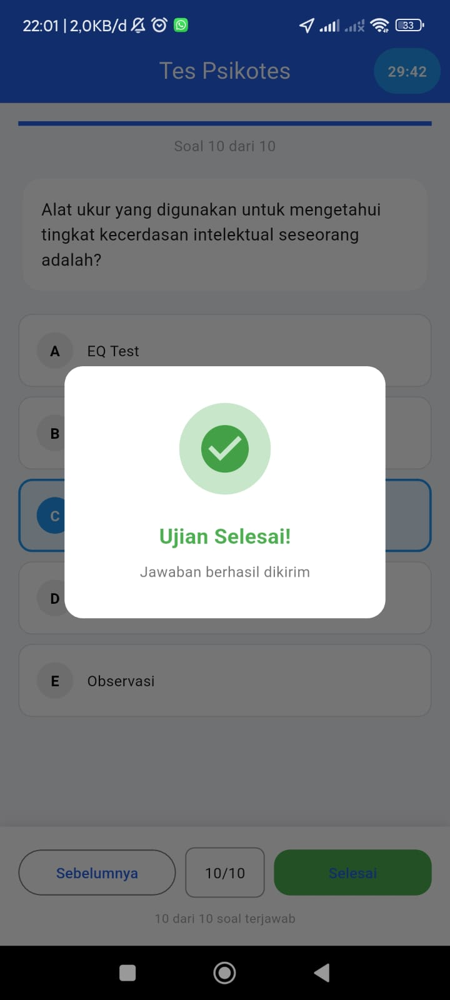

# CBT-LPK Mobile

Aplikasi **CBT-LPK Mobile** adalah aplikasi Computer Based Test (CBT) berbasis Flutter yang digunakan untuk pelaksanaan ujian secara digital. Aplikasi ini mendukung berbagai platform seperti Android, iOS, Web, Windows, MacOS, dan Linux.

---

## Daftar Isi
- [Penjelasan Aplikasi](#penjelasan-aplikasi)
- [Struktur File](#struktur-file)
- [Struktur Kode](#struktur-kode)
- [Fitur](#fitur)

---

## Penjelasan Aplikasi
Aplikasi ini dirancang untuk memudahkan pelaksanaan ujian secara online dengan fitur autentikasi, manajemen soal, pelaksanaan tes, dan penilaian otomatis. Dibangun menggunakan Flutter, aplikasi ini dapat berjalan di berbagai sistem operasi dan terintegrasi dengan layanan backend seperti Firebase.

---

## Struktur File
Berikut adalah struktur direktori utama pada proyek ini:

```
cbt_mobile/
├── android/                # Konfigurasi dan kode native Android
├── assets/                 # Asset aplikasi (gambar, ikon, dll)
├── build/                  # Output build (otomatis, dapat diabaikan)
├── ios/                    # Konfigurasi dan kode native iOS
├── lib/                    # Kode utama aplikasi Flutter
│   ├── core/               # Konstanta dan routing
│   ├── models/             # Model data (User, Test, Question)
│   ├── provider/           # Provider untuk state management
│   ├── screens/            # Halaman-halaman aplikasi
│   ├── services/           # Layanan (API, Auth, Local)
│   ├── firebase_options.dart # Konfigurasi Firebase
│   └── main.dart           # Entry point aplikasi
├── linux/                  # Konfigurasi Linux
├── macos/                  # Konfigurasi MacOS
├── test/                   # Unit dan widget test
├── web/                    # Konfigurasi Web
├── windows/                # Konfigurasi Windows
├── pubspec.yaml            # Konfigurasi dependencies Flutter
└── README.md               # Dokumentasi proyek
```

---

## Struktur Kode
Penjelasan singkat beberapa folder penting di dalam `lib/`:

- **core/**: Berisi file konstanta global dan pengaturan routing aplikasi.
- **models/**: Berisi model data seperti `UserModel`, `TestModel`, dan `QuestionModel`.
- **provider/**: Berisi provider untuk state management (misal: `AuthProvider`, `TestProvider`).
- **screens/**: Berisi halaman-halaman aplikasi, dikelompokkan berdasarkan fitur (auth, dashboard, profile, test, dll).
- **services/**: Berisi layanan untuk komunikasi dengan API, autentikasi, dan penyimpanan lokal.
- **firebase_options.dart**: Konfigurasi Firebase untuk berbagai platform.
- **main.dart**: Entry point aplikasi Flutter.

---

## Fitur
Aplikasi CBT-LPK Mobile memiliki fitur utama sebagai berikut:

- **Autentikasi Pengguna**: Login dan registrasi menggunakan email/password (terintegrasi dengan Firebase Auth).
- **Manajemen Soal**: Menampilkan daftar soal ujian yang diambil dari backend/API.
- **Pelaksanaan Tes**: Pengguna dapat mengerjakan soal secara interaktif, dengan timer dan navigasi antar soal.
- **Penilaian Otomatis**: Skor dihitung otomatis setelah tes selesai.
- **Dashboard**: Menampilkan ringkasan hasil tes dan informasi pengguna.
- **Profil Pengguna**: Pengguna dapat melihat dan mengedit profil mereka.
- **Multi-Platform**: Mendukung Android, iOS, Web, Windows, MacOS, dan Linux.
- **Integrasi Firebase**: Untuk autentikasi, database, dan notifikasi.

---
## Screenshots

Berikut adalah tampilan aplikasi CBT-Kiyoraka:

### Demo Aplikasi (GIF)

<div align="center">
	
</div>

| Login | Dashboard | Profile | Daftar Ujian | 
|-------|----------|---------|---------|
|  |  |  |  | 

| Informasi Tes | Tampilan Tes | PopUp | 
|-------|----------|---------|
|  |  |  |  


## Lisensi
IRS Project

## Inforamsi Proyek
Irgi Rangga Saputra 
23 CNS A


